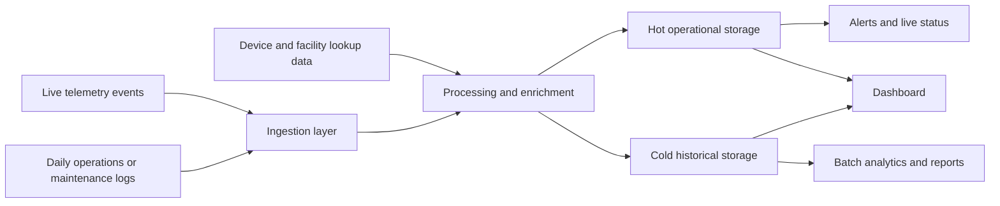

# Phase 2: Conceptual Pipeline Diagram

## Architecture Choice
This use case needs a hybrid pipeline.

- Live telemetry events need quick handling for alerts and current status.
- Daily operations or maintenance logs can be processed later for reports and historical analysis.
- Small supporting lookup data is used to enrich both live and batch flows.

## Conceptual Box Diagram

## What Each Box Means
- `Live telemetry events`: continuous readings from simulated refrigerators or storage units.
- `Daily operations or maintenance logs`: scheduled batch files used for bulk processing, compliance summaries, and historical analysis.
- `Device and facility lookup data`: small tables or files such as facility details, geography mapping, and threshold rules.
- `Ingestion layer`: receives incoming data and separates producers from downstream work.
- `Processing and enrichment`: validates data, removes duplicates, checks for breaches, joins reference data, and prepares outputs.
- `Hot operational storage`: stores the latest useful state for quick lookups and active monitoring.
- `Cold historical storage`: stores raw and processed history for reports and longer-term analysis.
- `Alerts and live status`: shows immediate problems that require action.
- `Dashboard`: combines live and historical views for operators.
- `Batch analytics and reports`: supports compliance summaries and trend analysis.

## Stream vs Batch Decision
### Stream Path
Use the stream path for:

- temperature breach detection
- current device status
- near-real-time alerting
- backlog and lag monitoring

### Batch Path
Use the batch path for:

- daily summaries
- compliance reporting
- historical trends
- reprocessing or backfilling when needed

## Phase 2 Outcome
The project should be treated as one unified pipeline with two processing styles:

- a live path for fast reaction
- a batch path for deeper analysis

The inputs are now fixed to three logical datasets:

- live telemetry events
- device and facility lookup data
- daily operations or maintenance logs

This decision is locked before choosing tools. The next step is to select one minimal tool per layer and avoid changing the stack mid-project unless a clear problem forces it.
