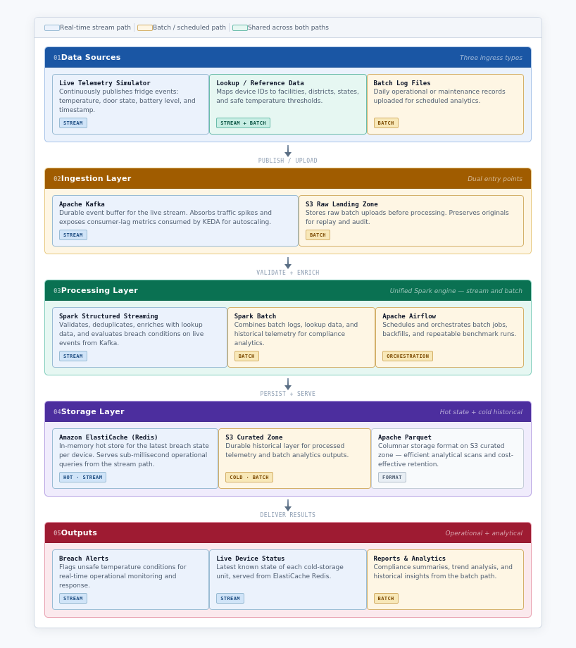
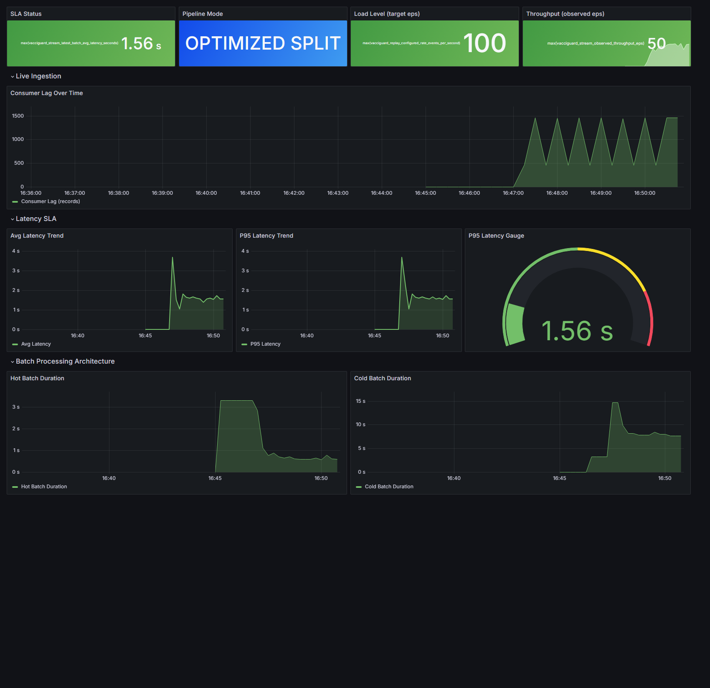
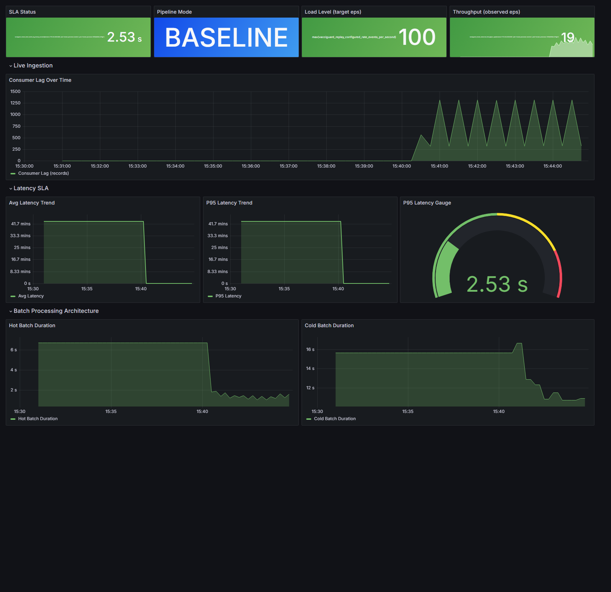

# VacciGuard

VacciGuard is a cloud-native monitoring pipeline for vaccine cold-chain telemetry. It ingests live device events, detects temperature breaches in near real time, stores device state for fast reads, and keeps a historical record for reporting and analysis.

This project started from a practical question: how do you keep a monitoring pipeline responsive when thousands of refrigeration devices reconnect at once? The final system runs on AWS, uses Kubernetes for deployment, and separates the low-latency alerting path from the heavier archival path so that operational writes do not get blocked by storage work.

## Why this project

Vaccines need to stay within a narrow temperature range from storage to administration. If a sensor reports a breach too late, the data is much less useful operationally. The project was designed around that constraint: fast enough for live monitoring, durable enough for audits, and simple enough to evaluate under controlled workloads.

## What the pipeline does

- Receives telemetry such as temperature, battery level, door state, and event time
- Streams live events through Kafka into Spark Structured Streaming
- Validates, deduplicates, and enriches the data with device reference information
- Writes the latest device state and active breach information to Redis for quick access
- Writes processed records, invalid events, and breach windows to S3 for analysis
- Supports scheduled batch summaries over archived data using Airflow and Athena

## Architecture

The project ended up with two distinct processing paths:

- a hot path for low-latency operational updates
- a cold path for archival storage and downstream analytics

That split is the main design decision behind the performance improvement. In the baseline version, both responsibilities lived in one streaming job. In the optimized version, they are separated so Redis updates can stay fast even when S3-facing work gets heavier.



## Key design choices

### 1. Split hot and cold responsibilities

The optimized pipeline uses separate deployments for the Redis-facing path and the S3-facing path. That gave the live path a much more stable latency profile during spike tests.

### 2. Keep the stack close to common cloud tooling

The system uses tools that fit naturally together for this kind of workload:

- Kafka for ingestion
- Spark Structured Streaming for stream processing
- Redis for current device state
- S3 and Parquet for historical storage
- Airflow and Athena for scheduled analytics
- Terraform, EKS, Prometheus, and Grafana for infrastructure and observability

### 3. Evaluate the architecture, not just the code

The project includes a baseline pipeline and an optimized pipeline, then compares them under normal load, spike load, and failure-recovery scenarios. That made it possible to show whether the design change actually mattered.

## Results

The SLA target was under 5 seconds end-to-end — from the moment a sensor fires to when the monitoring dashboard reflects the change. That's easy to hit at 100 events/second steady state. The real test was whether it held at 1,000 events/second, which simulates a mass device reconnection after a district-wide power outage.

Each scenario was run 3 independent times on a live EKS cluster. The numbers below are 3-run means.

| Scenario | Baseline avg | Baseline P95 | Optimized avg | Optimized P95 |
| --- | --- | --- | --- | --- |
| Normal load (100 eps, 5 min) | 2.67 s | 3.19 s | 1.56 s | 1.75 s |
| Spike load (1,000 eps, 5 min) | 231.78 s | 231.79 s | 2.10 s | 2.32 s |
| Failure recovery (pod kill at 3 min) | 3.27 s | 3.61 s | 1.78 s | 1.93 s |
| Recovery time | — | 64.4 s | — | 15.67 s |

The spike failure in the baseline came down to a single config parameter: `MAX_OFFSETS_PER_TRIGGER = 1000` on a 2-second trigger interval caps the hot path at 500 events/second. At 1,000 eps input the backlog grows faster than it drains, and after 5 minutes the last event has been sitting in Kafka for over 3 minutes. The pipeline never lost data — correctness was fine throughout — but timeliness completely fell apart.

Separating hot and cold into independent services fixed this. The hot path no longer waits on S3 commits, the offset cap is gone, and under the same 1,000 eps spike the mean latency dropped from 231.78 seconds to 2.10 seconds. Infrastructure cost per run stayed identical at roughly $0.017.

Those numbers matter more than the headline: the optimized version did not just run faster in ideal conditions, it stayed within the intended latency envelope when the workload became unfriendly.

**Optimized split pipeline — normal load, SLA well within target**



**Baseline pipeline — same load, for comparison**



**Failure recovery and data quality — optimized pipeline after a pod kill**

The panel below shows the recovery timeline (latency spike when the pod goes down, then returns to normal within ~15 seconds) alongside data quality metrics that stayed stable throughout.


For a fuller breakdown of the experiments, the repository also includes per-scenario evaluation writeups in `Evaluation Result/`.

## Repository guide

If you are reviewing the project for the first time, these are the folders worth opening first:

- `services/stream-processor/` for the main streaming job
- `services/replay-producer/` for replaying workloads into Kafka
- `services/batch-analytics/` for scheduled summary generation
- `services/evaluation-controller/` for automated evaluation runs
- `infra/kubernetes/` for the baseline and optimized deployments
- `infra/terraform/` for AWS infrastructure
- `orchestration/airflow/` for the batch workflow
- `scripts/` for local runs and evaluation helpers
- `tests/` for representative validation of the pipeline

## Running the project locally

For a local run, the shortest path is:

1. Install Python dependencies from `requirements-dev.txt`.
2. Generate the development workload.
3. Start Kafka, Redis, and the stream processor with Docker Compose.
4. Replay the sample workload.
5. Check Redis state and local output files.

You can run the end-to-end local flow with:

```bash
bash scripts/run-phase4-local.sh
```

If you want to step through it manually:

```bash
# Generate a small dev workload (300 events, 5 eps)
python3 scripts/generate-dev-workload.py

# Start the stack
docker compose up -d kafka redis stream-processor

# Replay the workload
docker compose run --rm replay-producer

# Check hot-path state in Redis
docker compose exec redis redis-cli GET device:status:FR-0102
docker compose exec redis redis-cli ZRANGE active_breaches 0 -1 WITHSCORES

# Check cold-path output
find data/output/processed -name '*.parquet' | sort
```

## AWS and evaluation notes

The AWS side of the project is set up for EKS-based deployment and repeatable evaluation runs. The repository includes:

- Kubernetes manifests for base, baseline, and optimized environments
- Terraform for infrastructure provisioning
- scripts for launching evaluation-controller jobs
- monitoring setup for Prometheus and Grafana

The evaluation workflow is centered on comparing the baseline and optimized variants under the same workload family rather than tuning one-off demo numbers.

## Tech stack

Python, Kafka, Spark Structured Streaming, Redis, Amazon S3, Airflow, Athena, Terraform, Kubernetes on EKS, Prometheus, and Grafana.
